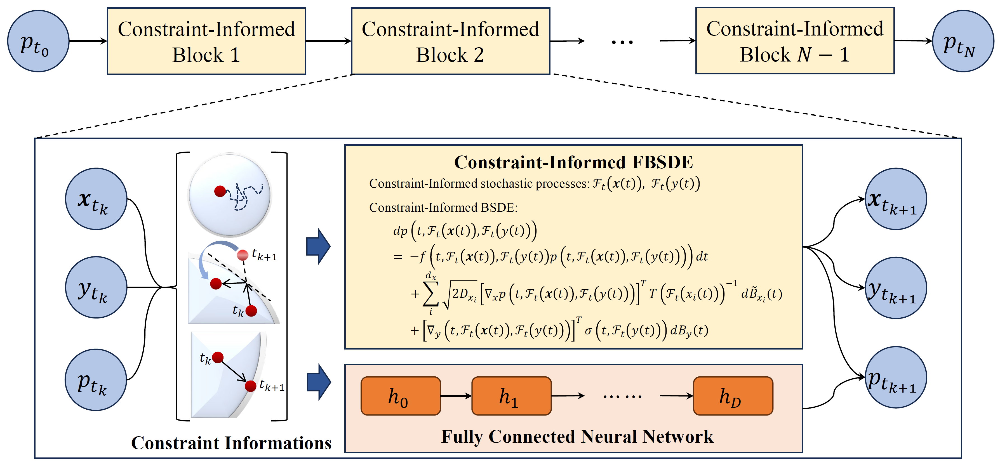

# Deep learning for high-dimensional PDEs on manifold with Neumann and Dirichlet boundary conditions

Authors: Heng Wang (wheng2025@lzu.edu.cn) and Weihua Deng (dengwh@lzu.edu.cn)

Address: School of Mathematics and Statistics, State Key Laboratory of Natural Product Chemistry, Lanzhou University, Lanzhou 730000, China.

# Environment configuration

python==3.13.5 torch==2.8.0+cu126

# Constraint-Informed BSDE method

# Abstract
The deep backward stochastic differential equation (BSDE) method is a deep learning algorithm for solving high-dimensional global partial differential equations (PDEs), which is trained using the sampled trajectories of microscopic stochastic processes; 
however, it is incapable of solving the problems in local and manifold domains. 
To overcome this issue, we propose a strategy compliant with BSDE theory in this paper, termed the Constraint-Informed BSDE method. 
The key idea of the Constraint-Informed BSDE method is to construct appropriate stochastic processes based on the physical implications of boundary conditions and manifold constraints, and further derive the BSDEs that the solutions to the corresponding PDEs satisfies. 
Specifically, we derive the BSDEs satisfied by the solutions of PDEs with Neumann and Dirichlet boundary conditions, and PDEs on sphere. 
Finally, we demonstrate the performance of the Constraint-Informed BSDE method through extensive numerical experiments.
Since there is no need to explicitly incorporate boundary conditions into the loss function, Constraint-Informed BSDE method exhibits sufficient accuracy, stability, and strong robustness.

# Example
We provide some invocation `example` in files with the `".ipynb"` extension, where you can define and modify any of the components in the sample for testing.