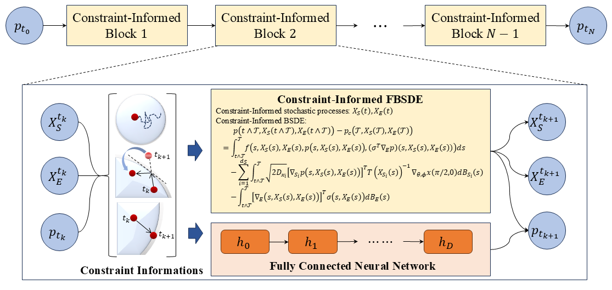

# Deep learning for high-dimensional PDEs on manifold with Neumann and Dirichlet boundary conditions

Authors: Heng Wang (wheng2025@lzu.edu.cn) and Weihua Deng (dengwh@lzu.edu.cn)

Address: School of Mathematics and Statistics, State Key Laboratory of Natural Product Chemistry, Lanzhou University, Lanzhou 730000, China.

## Constraint-Informed BSDE method



## Environment configuration

CPU: 13th Gen Intel(R) Core(TM) i7-13700K 64GB

python==3.13.9 torch==2.9.1

## Abstract

The deep backward stochastic differential equation (BSDE) method is a deep learning algorithm for solving high-dimensional partial differential equations (PDEs) in the whole space, which is trained using the sampled trajectories of microscopic stochastic processes; however, generally it is incapable of solving the problems on a manifold or with boundary constraints. To overcome this issue, we propose a strategy compliant with BSDE theory in this paper, termed the Constraint-Informed BSDE method. The key idea of the Constraint-Informed BSDE method is to first construct appropriate stochastic processes based on the physical implications of boundary conditions and manifold constraints, and further derive the BSDEs that the solutions to the corresponding PDEs satisfy. Specifically, we derive the BSDEs satisfied by the solutions of PDEs with Neumann and Dirichlet boundary conditions on multi-fold sphere and in high-dimensional domain. Finally, we demonstrate the performance of the Constraint-Informed BSDE method through extensive numerical experiments. Since there is no need to explicitly incorporate boundary conditions into the loss function, Constraint-Informed BSDE method exhibits sufficient accuracy, stability, and strong robustness.

## Project Structure

```
├── cibsde/                     # Model definitions
├── datasets/                   # Reference solutions
├── figures/                    # Figure outputs
├── Example1.ipynb              # Burgers' equation
├── Example2.ipynb              # Heat conduction in a square metal
├── Example3.ipynb              # Diffusion in an annular region
├── Example4.ipynb              # Diffusion on a sphere
├── Example5-1.ipynb            # Multiple microtubule search (P=1)
├── Example5-2.ipynb            # Multiple microtubule search (P=3)
├── Example6.ipynb              # Multiple microtubules capture a kinetochore
├── LICENSE                     # MIT License
└── README.md                   # Project overview, installation, usage, and documentation
```

## Example

We provide running examples for all numerical results in the paper in files with the `".ipynb"` extension, so that you can reproduce the code results.

## License

This project is licensed under the MIT License - see the [LICENSE](LICENSE) file for details.

## Citation

If you use this code in your research, please cite:
```bibtex
@article{Wang2026,
  title = {Deep learning for high-dimensional PDEs on manifold with Neumann and Dirichlet boundary conditions},
  author = {Wang, Heng and Deng, Weihua},
  url = {https://github.com/WANGH950/CIBSDE}
}
```